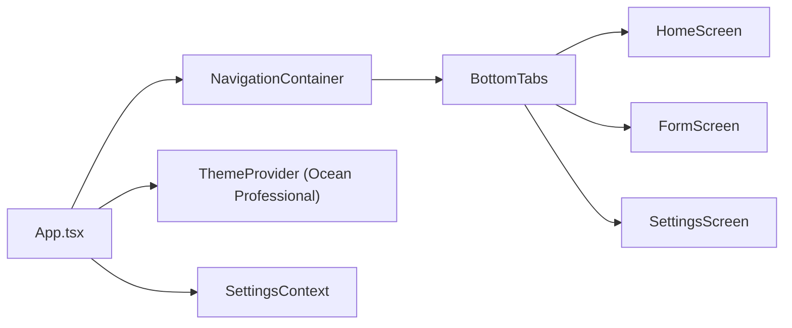

# React Native Mobile App — PRD and Architecture (Ocean Professional)

## Introduction and Goals
This document defines the product requirements and implementation-ready architecture for a React Native mobile app (Expo recommended) with a single container, mobile_frontend. The app delivers a modern, responsive UI with a tab-based layout, basic navigation, and simple forms. The Ocean Professional theme guides all visual choices to ensure a cohesive, professional look and feel.

Primary goals:
- Provide a clean, responsive, and accessible UI with a simple tab navigator.
- Implement three initial screens: Home, Form, and Settings.
- Support basic user input with validated forms and consistent theming.
- Keep scope frontend-only (no backend or database).

## In-Scope vs Out-of-Scope
### In-Scope
- React Native (Expo) mobile app with:
  - Tab-based navigation (bottom tabs).
  - Screens: Home, Form, Settings.
  - Basic user input and validation (e.g., text input, toggles).
  - Ocean Professional theme (colors, typography, spacing).
  - Light theme only (surface/background with subtle shadows).
  - Basic state handling for form inputs and settings.
  - Unit and basic integration testing for components and navigation.

### Out-of-Scope
- Backend services, APIs, and persistent databases.
- Authentication, authorization, and role management.
- Push notifications, deep linking, and analytics (future).
- Complex offline caching beyond React state-level memory.

## Personas and User Stories
### Personas
- General User: Wants a simple, polished mobile app to input data and adjust basic settings.
- QA/Tester: Needs consistent navigation and predictable UI to verify behavior.
- Developer: Seeks a clean architecture, consistent theming, and reliable tooling.

### User Stories
- As a user, I can navigate between Home, Form, and Settings using a bottom tab bar.
- As a user, I can submit a simple form with immediate validation feedback.
- As a user, I can change basic UI preferences (e.g., enable compact layout) in Settings and see them applied.
- As a tester, I can see uniform styling across screens that matches the Ocean Professional theme.

## Functional Requirements
- Bottom tab navigation with labeled icons for Home, Form, Settings.
- Home Screen:
  - Display a welcome message, theme sample components (buttons, cards).
- Form Screen:
  - Inputs: name (text), email (text), consent (switch).
  - Validation: required for name and email, email format check.
  - Submit button disabled until form is valid; show inline errors.
  - On submit, show success UI state (no backend call).
- Settings Screen:
  - Toggle: Compact layout on/off (affects spacing and maybe font size).
  - Persist setting in memory for the session (no storage required).
- Theming applied consistently to headers, tab bar, buttons, text, and form elements.

## Non-Functional Requirements
- Performance: Smooth transitions and responsive interactions on modern devices.
- Accessibility: Sufficient color contrast; accessible labels; focus order integrity.
- Responsiveness: Scales for common phone sizes and orientations.
- Reliability: App should not crash on navigation or invalid inputs.
- Maintainability: Modular folder structure with themed components and hooks.
- Testability: Unit tests for components and basic navigation flows.

## Success Metrics
- All three screens implemented and navigable.
- Form validation works with clear feedback; submit success state shown.
- Theming consistent with Ocean Professional palette.
- Passing unit tests for key components and navigation.
- Lint and format checks pass in CI.

## Assumptions and Constraints
- No backend; all data is ephemeral for the session.
- Expo-managed workflow recommended.
- Light theme only; dark theme considered future enhancement.
- No environment variables required for this phase.

## Milestones and Phasing
- M1: Project scaffold with Expo, navigation, and theme foundation.
- M2: Implement Home and Settings screens with shared components.
- M3: Implement Form screen with validation and success state.
- M4: Testing, linting, and formatting integrated; documentation finalized.

## Risks and Mitigations
- Theme inconsistency across components: Centralize theme tokens and use a ThemeProvider.
- Over-complex state: Use local component state and lightweight hooks; avoid global stores until needed.
- Accessibility gaps: Use React Native accessibility props; verify contrast and labels.
- Scope creep: Keep backend and advanced features out-of-scope for this iteration.

## System Architecture (Frontend-Only)
The app is a single React Native (Expo) application structured into feature-oriented modules. A global ThemeProvider exposes Ocean Professional tokens to components. Navigation is implemented with React Navigation’s bottom tabs. Forms use a lightweight form state library or React Hook Form for validation.

High-level flow:
- App.tsx initializes theme and navigation container.
- BottomTabNavigator defines Home, Form, Settings tabs.
- Screens compose shared UI components styled via theme tokens.
- Form screen validates inputs and manages UI-only success state.

## Navigation Architecture (Tab-Based)
- Navigation library: @react-navigation/native with @react-navigation/bottom-tabs.
- Three tabs:
  - HomeTab -> HomeScreen
  - FormTab -> FormScreen
  - SettingsTab -> SettingsScreen
- Header: Provided by stack options in each tab screen or a simple custom header component per screen, themed with primary color for accents and surface background.

Example pseudo-code:
```tsx
// navigation/BottomTabs.tsx
const Tab = createBottomTabNavigator();
export function BottomTabs() {
  return (
    <Tab.Navigator screenOptions={{ headerShown: true }}>
      <Tab.Screen name="Home" component={HomeScreen} />
      <Tab.Screen name="Form" component={FormScreen} />
      <Tab.Screen name="Settings" component={SettingsScreen} />
    </Tab.Navigator>
  );
}
```

## Theming and Design System (Ocean Professional)
Palette:
- Primary: #2563EB
- Secondary/Success: #F59E0B
- Error: #EF4444
- Background: #f9fafb
- Surface: #ffffff
- Text: #111827
- Gradient hint: from-blue-500/10 to-gray-50 (for subtle backgrounds)

Principles:
- Modern, minimal UI with subtle shadows and rounded corners.
- Use primary for actions and highlights; secondary for secondary actions/success states.
- Maintain contrast for text on background/surface.
- Consistent spacing scale (e.g., 4/8/12/16/24).
- Apply subtle elevation on cards and tab bar.

Theme object example:
```ts
// theme/colors.ts
export const colors = {
  primary: '#2563EB',
  secondary: '#F59E0B',
  success: '#F59E0B',
  error: '#EF4444',
  background: '#f9fafb',
  surface: '#ffffff',
  text: '#111827',
};
```

## State Management and Forms
- State: Local screen state and lightweight hooks; Settings stored in a React Context if cross-screen usage is needed.
- Forms: Prefer react-hook-form for input control and validation; Zod or Yup for schema validation if needed.
- Validation: Required fields, email regex; display inline errors under inputs; disable submit until valid.

Example with React Hook Form:
```tsx
// screens/FormScreen.tsx (snippet)
const { control, handleSubmit, formState: { errors, isValid } } = useForm({ mode: 'onChange' });
<Button disabled={!isValid} onPress={handleSubmit(onSubmit)} title="Submit" />
```

## Proposed Directory Structure
```text
mobile_frontend/
  app.json
  package.json
  App.tsx
  src/
    theme/
      colors.ts
      spacing.ts
      typography.ts
      index.ts
    navigation/
      BottomTabs.tsx
      index.ts
    screens/
      HomeScreen.tsx
      FormScreen.tsx
      SettingsScreen.tsx
    components/
      Button.tsx
      TextField.tsx
      SwitchRow.tsx
      Card.tsx
      Header.tsx
    hooks/
      useTheme.ts
      useSettings.ts
    state/
      SettingsContext.tsx
    utils/
      validation.ts
  tests/
    components/
    screens/
    navigation/
```

## Dependencies and Versions (Suggested)
- expo: latest SDK (e.g., SDK 51+)
- react: version compatible with Expo SDK
- react-native: version compatible with Expo SDK
- @react-navigation/native
- @react-navigation/bottom-tabs
- react-native-safe-area-context
- react-native-screens
- react-hook-form
- zod (optional for schema validation)
- dev: jest, @testing-library/react-native, @testing-library/jest-native, typescript, eslint, prettier

Example install (reference):
```bash
npx create-expo-app mobile_frontend --template
cd mobile_frontend
npx expo install react-native-screens react-native-safe-area-context
npm install @react-navigation/native @react-navigation/bottom-tabs
npm install react-hook-form zod
npm install -D jest @testing-library/react-native @testing-library/jest-native @types/jest ts-jest eslint prettier
```

## Testing Approach (Unit/Integration/Manual)
- Unit tests:
  - Theme utilities and components (Button, TextField, SwitchRow, Card).
  - Validation utilities (email format).
- Integration tests:
  - Navigation renders and switches tabs.
  - Form screen validation and submit button enable/disable.
- Manual testing:
  - Visual verification for spacing, colors, and accessibility.
  - Basic performance checks and device-size responsiveness.

## Developer Experience (Scripts, Linting, Formatting)
- Scripts:
  - start: expo start
  - test: jest
  - lint: eslint .
  - format: prettier --write "src/**/*.{ts,tsx,js,jsx}"
- Linting: ESLint with React/React Native and TypeScript presets.
- Formatting: Prettier with consistent rules.
- Commit hooks (optional): husky + lint-staged for pre-commit checks.

## Future Enhancements
- Persistent storage for settings (e.g., @react-native-async-storage/async-storage).
- Theming toggle (light/dark) with system preference support.
- API integration for data submission.
- Localization and i18n.
- Analytics, deep linking, and push notifications.
- Advanced accessibility testing with automated tools.

## Initial Screens Outline (Implementation-Ready)
### HomeScreen
- Header with app title; card showcasing theme tokens; primary/secondary buttons demo.

### FormScreen
- Name (required), Email (required, format), Consent switch.
- Validation via react-hook-form; inline error text; submit success banner or card.

### SettingsScreen
- Compact layout toggle; demonstrate immediate effect on spacing across screens via SettingsContext.



