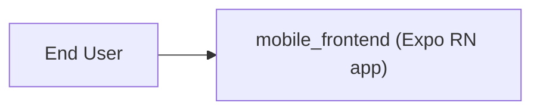
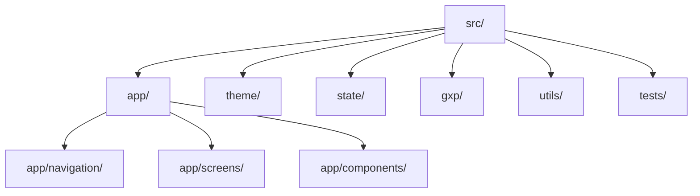

# Architecture Overview — mobile_frontend

## Introduction
This document describes the architecture for the mobile_frontend Expo React Native application. It covers system context, module structure, navigation, theming, state management, error handling, logging, testing, build/deployment, and security considerations. The architecture aligns with GxP standards, emphasizing audit trail, validation, and future support for electronic signatures.

## System Context
The application is a single-container mobile app running entirely on the device, with no backend or database. All data is local and ephemeral for the initial release.

- Actors
  - End User interacts with the mobile UI.
  - QA/Validation Engineer verifies compliance and test readiness.
  - Product Owner reviews artifacts and approves releases.

- External Systems
  - None in the initial release. Future phases may add backend APIs and authentication.

## Logical Architecture
- Presentation Layer: React Native screens, components, and navigation (tab-based).
- Application Layer: State management via Context or a lightweight store, validation utilities, and orchestrators.
- Infrastructure Layer: Logging, audit trail scaffolding, error boundaries/handlers, and platform utilities.

## Proposed Folder Structure (src/)
- src/
  - app/
    - navigation/ (tab navigator, screen registration)
    - screens/ (HomeScreen.tsx, ActivityScreen.tsx, SettingsScreen.tsx)
    - components/ (shared UI: Button, Card, Typography)
  - theme/
    - tokens.ts (Ocean Professional color and spacing tokens)
    - ThemeProvider.tsx (context/provider for theme)
  - state/
    - AppContext.tsx (React Context provider and hooks)
    - reducers/ (appReducer.ts)
    - selectors/ (appSelectors.ts)
  - gxp/
    - audit.ts (audit interfaces and in-memory logger)
    - validation.ts (input validation helpers)
    - errorBoundary.tsx (error boundary component)
    - logger.ts (structured logger utility)
    - esignature.ts (future capability placeholder and interfaces)
  - utils/
    - types.ts (shared TS types)
    - format.ts (format helpers, e.g., ISO timestamps)
  - tests/
    - unit/ (unit tests)
    - integration/ (navigation rendering and flow tests)

This structure supports modular development, testing, and future expansion.

## Navigation Approach
- Strategy: Bottom tab navigation with 2–3 tabs (Home, Activity, Settings).
- Rationale: Simple, discoverable structure suitable for initial features.
- Implementation: Use a community tab navigator (e.g., @react-navigation/bottom-tabs) in future; for now, define a local abstraction to keep dependencies minimal.
- Accessibility: Ensure labels are readable and selectable via screen readers.

## Theming Strategy (Ocean Professional)
- Centralize tokens in theme/tokens.ts:
  - primary: #2563EB
  - secondary: #F59E0B
  - success: #F59E0B
  - error: #EF4444
  - background: #f9fafb
  - surface: #ffffff
  - text: #111827
  - gradient: from-blue-500/10 to-gray-50
- Provide ThemeProvider.tsx to supply tokens via context.
- Apply standardized spacing, rounded corners, and subtle shadows consistently.
- Gradual enhancement: keep room for future dark mode toggle in Settings.

## State Management
- Initial approach: React Context with reducer for global lightweight state (e.g., preferences, UI flags).
- AppContext exposes typed hooks (useAppState, useAppDispatch).
- Keep state minimal; screen-specific state remains local where possible.
- Future extensibility: allow swapping to a more feature-rich store if complexity grows.

## Error Handling
- Error Boundary component (gxp/errorBoundary.tsx) wraps top-level navigation to catch render-time exceptions and display a user-friendly fallback.
- Centralized error utility to:
  - Format and sanitize error messages.
  - Log technical details to the logger and audit facilities.
- Provide retry and “go home” actions from fallback UI.

## Logging and Audit Trail
- logger.ts: Provides log levels (info, warn, error) and formatting.
- audit.ts: In-memory or console-based audit logger with:
  - userId (placeholder/local user)
  - timestamp (ISO 8601)
  - action (CREATE, READ, UPDATE, DELETE, or CUSTOM)
  - before/after snapshots where applicable
  - reason for change (optional)
- eSignature (esignature.ts): Define interfaces and placeholders for a future electronic signature mechanism, including signature binding concepts.

## Validation
- validation.ts: Input validators for forms and controls:
  - Data type checks, ranges, formats.
  - Cross-field rules if needed.
- Validators return typed results with errors suitable for UI messaging.
- Tests cover valid and invalid input scenarios.

## Testing Strategy
- Unit Tests (≥80% coverage target):
  - Components (render conditions and props).
  - Reducers/selectors.
  - Logger/audit utilities.
  - Validation utilities.
- Integration Tests:
  - Navigation flows (tab switching).
  - Error boundaries and fallback messaging.
  - Settings changes and audit invocations.
- Validation Tests (GxP focus):
  - Audit trail records critical actions.
  - Input validation prevents invalid data.
  - Error handling is comprehensive and user-friendly.
- Test Data:
  - Non-sensitive sample data fixtures for predictable tests.
- Coverage:
  - Aim for overall coverage ≥80% for unit tests.

## Build and Deployment
- Expo-based workflows:
  - Development: expo start on local devices/emulators.
  - CI/CD: scripts that run linting, unit tests in CI mode, and build artifacts when applicable.
- Android prebuild script exists; iOS build strategy can be added later if needed.
- Sign-off:
  - Release gate checklist in PRD guides approvals.

## Security Considerations
- No sensitive data storage in the initial release.
- Defensive logging: avoid secrets or personal data.
- Access controls: simple local role checks may be added to control UI features; full RBAC awaits backend.
- Future: integrate secure storage and authentication providers when backend arrives.

## Mermaid Diagrams

### System Context Diagram

### Module Structure Diagram

## Compliance Alignment (GxP)
- Data Integrity (ALCOA+): Audit events are contemporaneous, structured, and attributable (local user context placeholder).
- Mandatory Controls:
  - Audit Trail: Interfaces and in-memory logging available.
  - Electronic Signature: Placeholder for future; documented in design.
  - Validation Controls: Input validation utilities and tests present.
  - Error Handling: Error boundary and standardized error logging.
  - Access Controls: Minimal local checks; scalable to RBAC with backend.
- Documentation: PRD, Traceability Matrix, Validation Plan provide traceability and review readiness.

## References
- PRD.md — requirements and acceptance criteria.
- TraceabilityMatrix.md — mapping requirements to implementation and tests.
- ValidationPlan.md — test categories and coverage targets.
