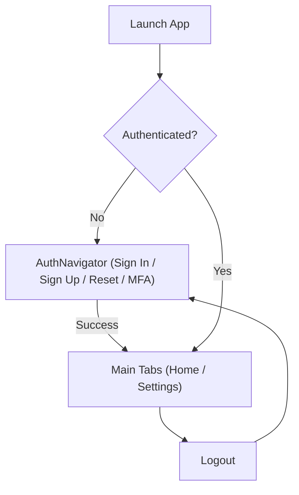

# Authentication Implementation Proposal — mobile_frontend

## Overview and assumptions
This proposal outlines the frontend-centric approach to implement user authentication in the Expo React Native application using the Ocean Professional theme. It focuses on architectural choices, UI flows, state management, secure storage, navigation guards, network client integration hooks, GxP controls (audit, validation, electronic signatures), environment variables, and a comprehensive testing plan. No backend is currently specified; therefore, we recommend using a hosted authentication provider for speed and compliance benefits, while also defining a local-only mock mode for development and offline demos.

Assumptions:
- The app uses Expo (managed workflow) with React Navigation bottom tabs (Home, Settings) and TypeScript.
- No existing backend/API is required; when provider-based auth is selected, minimal calls are made to hosted auth endpoints (e.g., Firebase Auth or Auth0).
- GxP guardrails are required: audit trail for auth events, validation of inputs, error handling patterns, and electronic signature scaffolding for critical actions.
- Visual design follows Ocean Professional: primary #2563EB, secondary/success #F59E0B, error #EF4444, background #f9fafb, surface #ffffff, text #111827.

## Recommended auth options comparison
We evaluated three options:

1) Firebase Authentication (Hosted)
- Pros: Mature SDK, multi-platform, built-in providers (email/password, phone, OAuth), MFA support via phone/OTP, good docs, device-friendly with Expo.
- Cons: Requires Firebase project, configuration, and network connectivity.
- GxP: Strong support for auditability via custom logging; MFA coverage; can integrate with backend audit sinks later.

2) Auth0 (Hosted)
- Pros: Enterprise-grade, secure flows (Universal Login), broad MFA options (TOTP, push, SMS), B2C/B2B, hooks/rules, excellent docs, RBAC features.
- Cons: Requires tenant setup, pricing, and hosted login page customizations; network connectivity required.
- GxP: Strong; supports advanced audit, anomaly detection, and policy enforcement.

3) Local-only Mock (No external service)
- Pros: Works offline; fastest for prototyping and demos; zero signup or secrets.
- Cons: No real security; MFA and password reset simulated; not suitable for production.
- GxP: Suitable for demo/validation scaffolding only; not adequate for real users or non-repudiation.

Summary:
- For fastest production path with robust MFA and enterprise features, choose Auth0.
- For developer velocity with broad provider support and mobile-centric flows, Firebase Auth is an excellent path.
- For development-only or offline demos, use the Local Mock mode behind a feature flag.

## Selected baseline recommendation
Baseline path: Firebase Authentication for initial implementation due to strong Expo support, straightforward SDK integration, and balance of speed and capability. Provide an easy switch to Local Mock for development/offline testing and leave notes for a future Auth0 migration if enterprise SSO becomes a requirement.

Provider selection flag:
- AUTH_PROVIDER = firebase | auth0 | mock
- For this proposal, we document Firebase as baseline while outlining how to swap to mock provider.

## Required packages and dependencies
- React Navigation (already present): @react-navigation/native, @react-navigation/bottom-tabs
- Expo and RN (already present): expo, react-native-screens, react-native-safe-area-context
- Secure storage:
  - expo-secure-store (preferred for storing refresh tokens/session metadata)
- Auth provider SDKs (provider-dependent):
  - Firebase: firebase
  - Auth0 alternative: react-native-auth0 (optional)
- Validation:
  - zod or a minimal custom validator (can start with simple custom validation in gxp/validation.ts)
- Testing:
  - jest-expo, @testing-library/react-native (if/when test runner is set up)
- Optional networking:
  - axios or fetch wrappers (native Fetch is sufficient for basic calls)

Note: For Expo managed, ensure the chosen SDKs are compatible with Expo Go or use prebuild if native modules are required. Expo Secure Store is supported in managed apps.

## Proposed folder/file changes
New/updated directories under src/ (aligned with existing structure):
- src/auth/
  - providers/
    - firebase.ts: initialize Firebase app; implement signIn, signUp, signOut, sendPasswordReset, getIdToken, onAuthStateChanged, optional MFA helpers
    - mock.ts: local in-memory user store and fake flows (MFA mocked)
    - types.ts: common AuthUser, Session, AuthProvider interface
  - hooks/
    - useAuth.ts: hook to access auth context and actions
  - AuthContext.tsx: React context providing auth state (user, session, status) and actions
  - routeGuards.tsx: helpers (withAuthGuard, withRoleGuard)
- src/screens/auth/
  - SignInScreen.tsx
  - SignUpScreen.tsx
  - MFAScreen.tsx (for code entry if using MFA phone/email OTP)
  - PasswordResetScreen.tsx
  - LogoutScreen.tsx or simple action within Settings
- src/navigation/
  - AuthNavigator.tsx: stack for auth screens
  - modify TabNavigator to switch between AuthNavigator (unauthenticated) and MainTabs (authenticated)
- src/state/
  - Extend reducers/selectors only if needed for role info beyond auth context
- src/gxp/
  - audit.ts: add auth-related event helpers (AUTH_SIGNIN, AUTH_SIGNOUT, AUTH_RESET, AUTH_MFA)
  - esignature.ts: add e-sign interfaces for critical actions confirmation
  - validation.ts: form input schemas or validators for email/password/MFA codes
- src/utils/
  - secureStore.ts: small wrapper around expo-secure-store for consistent get/set/delete with namespacing

File-level change suggestions:
- App.tsx: Wrap root navigation with AuthContext provider; enable screens already done; add ErrorBoundary if present per Architecture docs.
- src/navigation/TabNavigator.tsx: Gate content based on auth state; if unauthenticated, render AuthNavigator; otherwise, render current tab navigator. Maintain Ocean Professional colors.
- src/screens/SettingsScreen.tsx: Add “Sign Out” action; display user info; add audit triggers.
- src/theme/colors.ts: Already aligned to Ocean Professional; reuse for auth screens.

## Navigation and route guarding
- Introduce AuthNavigator (Stack) with screens:
  - Sign In -> optional MFA -> Main Tabs
  - Sign Up -> Post-signup path -> optional MFA -> Main Tabs
  - Password Reset (link from Sign In)
- Route guard strategy:
  - High-level guard: NavigationContainer checks auth state from AuthContext to decide whether to render AuthNavigator or Main Tabs.
  - Per-screen/feature guards: withAuthGuard HOC wraps screens requiring authentication; withRoleGuard for role-based access (future).
- Deep linking:
  - Reserve deep link routes for password reset or email verification if needed by provider.

Mermaid diagram: High-level navigation flow


## UI screens and components
- Sign In:
  - Fields: email/username, password
  - Actions: Sign In, “Forgot password?”, “Create account”
  - Theme: Ocean Professional; primary button #2563EB; error #EF4444 messages
- Sign Up:
  - Fields: email, password, confirm password; terms consent checkbox
  - Actions: Create account, link back to Sign In
- MFA:
  - Input: 6-digit code from SMS/Email/Authenticator (provider-dependent)
  - Actions: Verify, Resend code
- Password Reset:
  - Field: email
  - Actions: Send reset link/code
- Session Management:
  - Persist refresh token/ID token as needed in secure storage
  - Auto-restore on app start; refresh tokens securely handled via provider SDK where applicable
- Logout:
  - Button in Settings; optional confirmation dialog; audit log event

Accessibility:
- Minimum tappable sizes; labeled inputs; proper role descriptions; color contrast AA.

## State management and secure storage
- AuthContext maintains:
  - user: AuthUser | null
  - session: { idToken?: string; refreshToken?: string; expiresAt?: number }
  - status: 'idle' | 'loading' | 'authenticated' | 'unauthenticated' | 'mfa_required'
  - actions: signIn, signUp, signOut, sendPasswordReset, verifyMfa, resendMfa, refreshSession, getIdToken
- Secure storage (expo-secure-store):
  - Keys: auth.idToken, auth.refreshToken, auth.user
  - Use namespaced keys and minimal data at rest; avoid storing passwords
  - Clear on signOut
- Considerations:
  - Token refresh: prefer provider SDK; fallback timer to refresh if available
  - Web preview: secure store polyfill; for web builds, fallback to memory/localStorage based on Expo behavior with explicit warning banner in non-secure contexts

## API/client integration hooks
- Providers implement common AuthProvider interface:
  - init(config): Promise<void>
  - onAuthStateChanged(cb): unsubscribe function
  - signIn(credentials)
  - signUp(data)
  - signOut()
  - sendPasswordReset(email)
  - verifyMfa(code)
  - getIdToken(forceRefresh?): Promise<string | null>
- useAuth() hook exposes above actions from context, plus user/session/status.
- For future backend calls:
  - add fetchWithAuth wrapper to inject Authorization: Bearer <idToken> header when available
  - add anti-replay nonce if backend requires
- Network error mapping:
  - Normalize provider errors into app-level error codes for consistent UI messages.

## GxP compliance controls (audit, e-sign)
- Audit Trail:
  - Log events: AUTH_INIT, AUTH_SIGNIN_ATTEMPT, AUTH_SIGNIN_SUCCESS, AUTH_SIGNIN_FAILURE, AUTH_SIGNOUT, AUTH_SIGNUP, AUTH_RESET_REQUEST, AUTH_RESET_SUCCESS, AUTH_MFA_REQUIRED, AUTH_MFA_VERIFY_SUCCESS, AUTH_MFA_VERIFY_FAILURE, TOKEN_REFRESH
  - Fields: timestamp (ISO 8601), userId (if available), action, metadata (provider, device info where permissible), result, reason (optional)
  - Storage: initially in-memory/console; design interface to later send to compliant backend
- Electronic Signature:
  - For critical actions (e.g., approve/submit), require “re-authenticate + sign” step
  - Interfaces in gxp/esignature.ts:
    - requestSignature({ purpose, payloadHash }): triggers credential re-entry and binds signature to payload hash
    - verifySignature(): ensures recent auth and binds user+timestamp+reason
  - UI: confirm dialog with reason field and re-enter password/code; for hosted providers, utilize recent login verification endpoints
- Validation:
  - Input validation for all auth forms (email format, password strength, code length)
  - Validation errors mapped to friendly messages; technical logs to audit
- Error Handling:
  - Try/catch around provider calls; user-friendly messages; audit technical details without secrets
- Access Controls:
  - Roles scaffold in AuthUser.claims (e.g., roles: string[]); withRoleGuard HOC enforces role checks before rendering critical screens

## Validation and error handling patterns
- Validation:
  - Email regex or validator; password min length and composition per policy; MFA code numeric length 6
  - Cross-field: password confirmation matches
- Error handling:
  - Normalize provider errors to codes like INVALID_CREDENTIALS, USER_NOT_FOUND, WEAK_PASSWORD, MFA_REQUIRED, NETWORK_ERROR, RATE_LIMITED
  - Display localized, friendly messages; log technical codes to audit
- Retry strategies:
  - Simple exponential backoff for resend MFA; limit attempts for security
- Security notes:
  - Never log plaintext credentials
  - Redact PII in logs

## Access control and roles scaffold
- AuthUser type includes:
  - id, email, displayName, claims?: { roles?: string[]; [k: string]: unknown }
- Role guard:
  - withRoleGuard(Component, requiredRoles: string[])
  - Deny screen shows “Insufficient permissions” with audit event AUTH_ACCESS_DENIED
- Future RBAC sourcing:
  - Hosted provider custom claims or backend-provided claims endpoint

## Environment variables required
Define in app config (e.g., app.config.js or via Expo env workflow):
- AUTH_PROVIDER=firebase|auth0|mock
- For Firebase:
  - FIREBASE_API_KEY
  - FIREBASE_AUTH_DOMAIN
  - FIREBASE_PROJECT_ID
  - FIREBASE_APP_ID
  - FIREBASE_MESSAGING_SENDER_ID (if needed)
- For Auth0 (optional future):
  - AUTH0_DOMAIN
  - AUTH0_CLIENT_ID
  - AUTH0_AUDIENCE (if using API authorization)
  - AUTH0_REDIRECT_URI, AUTH0_LOGOUT_REDIRECT_URI (web deep link usage)
- GxP flags:
  - GXPC_ENABLE_AUDIT=true
  - GXPC_REQUIRE_ESIGN_ON_CRITICAL=true (gate specific flows)
- Security posture:
  - AUTH_TOKEN_STORAGE=securestore|memory (default securestore; memory fallback for web)

Keep secrets out of the repo; use Expo secrets manager or CI environment injection.

## Testing plan (unit/integration/validation)
Unit tests (target ≥80% for auth modules):
- Providers:
  - mock provider full coverage
  - firebase provider: mock SDK calls, verify mapping and error normalization
- Context and hooks:
  - AuthContext: state transitions, restore from secure store, signIn/Out flows, MFA state
  - useAuth: action proxies and error paths
- Validation:
  - email, password, MFA code validators (valid/invalid)
- GxP:
  - audit trail event emission for each flow
  - e-sign interface request/verify stubs

Integration tests:
- Navigation:
  - Unauthenticated users see SignIn
  - Successful sign in transitions to Main Tabs
  - Logout returns to SignIn
- MFA:
  - When provider indicates MFA required, navigate to MFAScreen and complete flow
- Password Reset:
  - Submit email triggers success UI state (simulated in mock)
- Access Control:
  - Role-guarded screen denies access and logs event

Validation tests (GxP focus):
- Verify audit event fields for critical auth actions (attributable, timestamped, contemporaneous)
- Ensure e-sign flow requires recent authentication for critical actions (placeholder simulation in mock)
- Confirm error handling shows user-friendly message and logs technical code

CI notes:
- jest-expo and @testing-library/react-native recommended to run tests in CI; mark heavier provider flows with mocks
- Avoid real network calls in CI; rely on mock provider

## Documentation and traceability
- Update docs:
  - Architecture.md: add Authentication Architecture section summarizing providers, context, secure storage, and navigation guards
  - PRD.md: add requirements for authentication, MFA, password reset, session management, logout, and GxP controls (new REQ IDs)
  - TraceabilityMatrix.md: map new REQ-1xx for auth to implementation files and tests
  - ValidationPlan.md: add auth-specific validation and test protocols
- Maintain mermaid diagrams for auth flow and module relationships
- Ensure comments in code include requirement IDs for traceability

## Step-by-step implementation checklist
1) Dependencies
- Install: expo-secure-store; firebase (if using Firebase); optionally react-native-auth0 (future)
- Verify Expo compatibility; no native prebuild required for these selections

2) Configuration
- Add environment variables for selected provider (AUTH_PROVIDER and provider config)
- Implement app.config.js or use Expo Secrets for runtime config

3) Auth Provider Abstraction
- src/auth/types.ts: define AuthProvider, AuthUser, Session types
- src/auth/providers/firebase.ts: initialize Firebase; implement interface
- src/auth/providers/mock.ts: implement local mock with MFA simulation

4) Secure Storage
- src/utils/secureStore.ts: getItem, setItem, deleteItem with namespacing

5) Auth Context and Hooks
- src/auth/AuthContext.tsx: manage auth state, persistence, effect to restore session, and onAuthStateChanged subscription
- src/auth/hooks/useAuth.ts: expose state and actions

6) Navigation Integration
- src/navigation/AuthNavigator.tsx: stack screens for SignIn, SignUp, Reset, MFA
- Update src/navigation/TabNavigator.tsx: conditional rendering: if not authenticated show AuthNavigator, else Main Tabs

7) UI Screens
- src/screens/auth/*: SignInScreen, SignUpScreen, PasswordResetScreen, MFAScreen
- Ocean Professional styling; input validation and error messages

8) GxP Controls
- src/gxp/audit.ts: add auth event helpers; ensure all actions log events
- src/gxp/esignature.ts: define e-sign interfaces and mock implementation for critical action signature
- src/gxp/validation.ts: implement validators for auth forms

9) Access Control Scaffold
- withRoleGuard HOC and sample role-protected component route

10) Testing
- Unit: providers, context/hook, validation, audit
- Integration: navigation transitions and guarded routes
- Validation: GxP test scenarios for audit trail and e-sign placeholders

11) Documentation
- Update Architecture.md, PRD.md, TraceabilityMatrix.md, ValidationPlan.md with new auth content and REQ IDs

12) Release Checks
- Lint passes
- Tests ≥80% coverage in auth modules
- Manual smoke test on devices/emulator: SignIn/Up, MFA (mock), Reset, Logout

## File-level change suggestions aligned to Ocean Professional theme
- src/screens/auth/SignInScreen.tsx
  - Layout: SafeAreaView with background #f9fafb; card surface #ffffff; primary button #2563EB; links in secondary #2563EB underlined
  - Error messages in #EF4444; subtle shadow on card; rounded corners
- src/screens/auth/MFAScreen.tsx
  - 6-digit input boxes with clear focus; “Resend code” highlight; timer text in gray (#6B7280)
- src/navigation/AuthNavigator.tsx
  - Header tint and text use colors.primary and colors.text
- src/navigation/TabNavigator.tsx
  - Conditional: render AuthNavigator when status !== 'authenticated'
- src/screens/SettingsScreen.tsx
  - Add user profile summary (email), Sign Out button in secondary style; audit log on click

## Backend dependencies (not implemented here)
- If using provider-based auth:
  - Email templates and domain verification managed in provider console
  - MFA enrollment/recovery policy configured at provider
  - Optional session validation endpoints for backend APIs (future)
- For e-signature non-repudiation:
  - Requires backend service to store signature artifacts with data binding and audit retention

## Appendix: Example interfaces (snippets)
AuthProvider interface:
```ts
export interface AuthUser {
  id: string;
  email?: string;
  displayName?: string;
  claims?: { roles?: string[]; [k: string]: unknown };
}

export interface Session {
  idToken?: string;
  refreshToken?: string;
  expiresAt?: number;
}

export interface AuthProvider {
  init(config?: Record<string, unknown>): Promise<void>;
  onAuthStateChanged(cb: (user: AuthUser | null) => void): () => void;
  signIn(input: { email: string; password: string }): Promise<void>;
  signUp(input: { email: string; password: string }): Promise<void>;
  signOut(): Promise<void>;
  sendPasswordReset(email: string): Promise<void>;
  verifyMfa(code: string): Promise<void>;
  getIdToken(forceRefresh?: boolean): Promise<string | null>;
}
```

Route guard HOC sketch:
```ts
export function withAuthGuard<T>(Component: React.ComponentType<T>) {
  return (props: T) => {
    const { status } = useAuth();
    if (status !== 'authenticated') {
      return <AuthNavigator />;
    }
    return <Component {...props} />;
  };
}
```

Audit logging usage:
```ts
audit.log({
  action: 'AUTH_SIGNIN_ATTEMPT',
  userId: null,
  timestamp: new Date().toISOString(),
  metadata: { provider: 'firebase' },
});
```

## Sources
- mobile_frontend App and navigation setup:
  - mobile_frontend/App.tsx
  - mobile_frontend/src/navigation/TabNavigator.tsx
  - mobile_frontend/src/screens/HomeScreen.tsx
  - mobile_frontend/src/screens/SettingsScreen.tsx
  - mobile_frontend/src/theme/colors.ts
- Existing GxP-aligned documentation:
  - mobile_frontend/react-native-mobile-app-210485-210494/docs/Architecture.md
  - mobile_frontend/react-native-mobile-app-210485-210494/docs/PRD.md
  - mobile_frontend/react-native-mobile-app-210485-210494/docs/TraceabilityMatrix.md
  - mobile_frontend/react-native-mobile-app-210485-210494/docs/ValidationPlan.md
